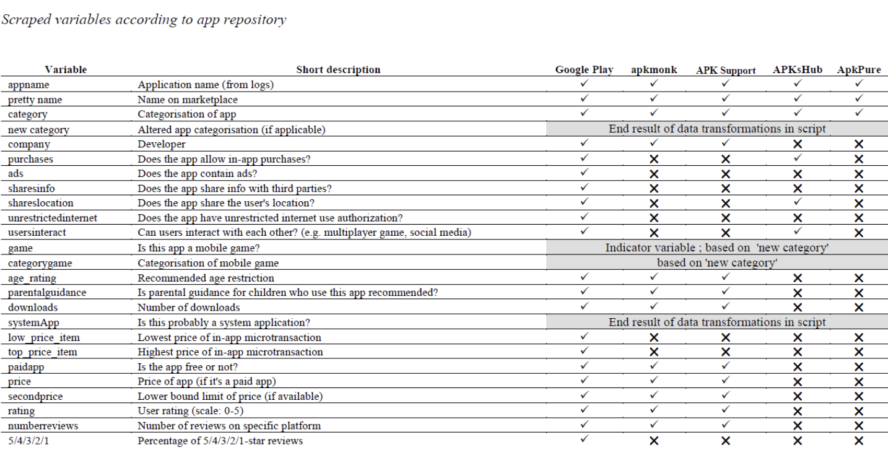

# ml-capstone
ML Capstone

Create a model that predicts whether or not a pitched app will reach a threshold of downloads or not.

The model will be trained on the [Android Apps Metadata dataset](https://www.kaggle.com/datasets/kboghe/android-apps-metadata?select=Android+apps+csv.csv)

### Dataset Field Information:

